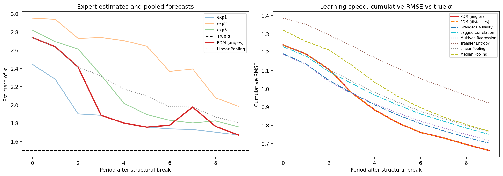

# Pioneer Detection Method (PDM)

[](https://doi.org/10.1057/s41288-025-00367-y)
[](https://arxiv.org/abs/2511.16760)
[](https://ssrn.com/abstract=5012810)
[](https://github.com/skimeur/pioneer-detection-method/actions/workflows/ci.yml)
[](https://www.python.org)
[](LICENSE)

*A convergence-based expert-aggregation algorithm for opinion pooling, forecast combination, and collective decision-making under structural change.*

This repository contains the official Python implementation of the **Pioneer Detection Method (PDM)**, the algorithm introduced in:

**Eric Vansteenberghe (2026)**  
*Insurance supervision under climate change: a pioneer detection method.*  
*The Geneva Papers on Risk and Insurance – Issues and Practice*, 51(1), 176–207.  
https://doi.org/10.1057/s41288-025-00367-y

Open access versions: [arXiv:2511.16760](https://arxiv.org/abs/2511.16760) · [SSRN 5012810](https://dx.doi.org/10.2139/ssrn.5012810)



*After a structural break in an unobservable Pareto tail parameter, PDM (red) converges toward the truth faster than linear pooling (dotted) — and beats all seven benchmark aggregation methods on RMSE (right panel). Reproduce with `python pdm_demo.py`.*

---

## 1. What is the Pioneer Detection Method (PDM)?

The Pioneer Detection Method is an expert‑aggregation algorithm designed for environments characterized by:

- structural change and regime shifts
- heterogeneous learning speeds
- fat‑tailed or non‑Gaussian risks
- fragmented information
- unobservable true parameters

Instead of pooling experts by performance (which is impossible when the true parameter is unknown), PDM detects **directional convergence**:

> A “pioneer” is an expert whose estimate moves first in the correct direction, and toward whom other experts converge over time.

PDM uses three convergence criteria:

- **Distance reduction** – others move closer to the candidate pioneer
- **Orientation** – others move toward the pioneer
- **Attribution proportion** – how much of the movement comes from peers

The algorithm produces dynamic weights that sum to 1 whenever at least one pioneer exists; otherwise it defaults to the cross‑sectional mean.

---

## 2. Installation

```bash
pip install pioneer-detection
```

Or the latest development version straight from GitHub:

```bash
pip install "pioneer-detection[stats] @ git+https://github.com/skimeur/pioneer-detection-method.git"
```

The core package needs only `pandas` and `numpy`. The `[stats]` extra adds `statsmodels`, required for the Granger Causality and Multivariate Regression benchmark methods; `[demo]` also adds `matplotlib` for the demo plots.

```python
import pandas as pd
from pioneer_detection import compute_pioneer_weights_angles, pooled_forecast

# forecasts: DataFrame (T x N) of expert forecasts or estimates
weights = compute_pioneer_weights_angles(forecasts)
pooled  = pooled_forecast(forecasts, weights)
```

Working from a clone of this repository (as in the course material), `from pdm import ...` keeps working unchanged.

---

## 3. Applications

### 3.1 Insurance Supervision & Climate Risk

Based on yearly aggregate loss data, PDM helps supervisors assess tail‑risk dynamics under climate change. Use cases include:

- tail‑parameter estimation under Pareto‑type risks
- monitoring insurability after climate shocks
- pooling fragmented expertise across insurers
- mitigating uncertainty when reinsurance capacity withdraws

### 3.2 Time‑Series Forecasting Under Regime Shifts

PDM improves robustness in:

- macroeconomic forecasting under structural breaks
- climate‑sensitive time series
- low signal‑to‑noise environments
- model uncertainty and forecast combination

It is suited to settings where the “truth” is never directly observed.

### 3.3 Multi‑Agent Systems & Robotics

PDM extends naturally to distributed‑sensing systems: drone swarms, robotic fleets, underwater autonomous vehicles, coordinated automated‑vehicle systems, sensor networks, and decentralized AI agents.

In these systems, PDM can:

- identify early detectors of environmental changes
- neutralize agents whose signals push the system in unsafe directions (algorithmically by down‑weighting)
- produce stable swarm‑level situational awareness
- enhance collective adaptation under partial detection

---

## 4. Contents of the Repository

```
pioneer_detection/     # pip-installable package (core implementation)
pdm.py                 # backwards-compatible import shim (from pdm import ...)
pdm_demo.py            # synthetic demo with plots (reproduces the figure above)
tests/                 # unit tests (pytest)
paper.pdf              # published article (full text)
slides.pdf             # presentation slides
extended-abstract.md   # short summary of the paper

# Teaching material (euro-area inflation exercise and exam)
exercise_pdm_inflation.py / .tex / .pdf
exam_counterfactual_ukraine_inflation.tex / .pdf
ecb_hicp_panel_var_granger.py
data_ecb_hicp_panel.csv, data_ukraine_cpi_raw.csv
```

---

## 5. Example

A complete Bayesian learning benchmark is provided in `pdm_demo.py`.

**Simulation setup** (matching the paper):
- Losses follow a Pareto distribution with an unobservable tail parameter `alpha_t`
- At `t=0`, `alpha` undergoes a structural break from `alpha_minus=3.0` to `alpha_plus=1.5`
- 3 non-cooperative Bayesian experts each draw independent Pareto samples and update their posterior estimate
- Expert 1 (the pioneer) receives 6 observations per period; Experts 2-3 receive 5 each
- The supervisor never observes `alpha_t` and must pool expert estimates using one of the 8 methods

**Outputs**:
- Single-seed RMSE table comparing all methods against the true `alpha`
- 100-run Monte Carlo for robust average RMSE comparison
- Two plots: expert estimates vs. true parameter, and cumulative RMSE learning curves

Run:

```bash
pip install "pioneer-detection[demo]"
python pdm_demo.py
```

---

## 6. Reference Implementation Details

The package implements all methods introduced and compared in the published article. Each method returns a `(T x N)` DataFrame of weights (or a pooled Series for median pooling) that can be passed to `pooled_forecast()`.

### 6.1 PDM Variants

#### PDM with Angles (preferred method) — `compute_pioneer_weights_angles`

The canonical 3-step method using angle-based weighting (Equation 4–5 of the paper). Angles capture the *speed* of convergence between time series.

**Step 1 — Distance reduction condition**
```
δ_distance = 𝟙( |x_i^t − m_{-i}^t| < |x_i^{t−1} − m_{-i}^{t−1}| )
```

**Step 2 — Orientation condition (angle-based)**
```
θ_i  = arctan(|Δx_i| / s)     # expert's movement angle
θ_{-i} = arctan(|Δm_{-i}| / s)  # peers' movement angle
δ_orientation = 𝟙( θ_{-i} > θ_i )
```
where `s` is the time step between observations.

**Step 3 — Proportion attribution (angle-based)**
```
w_i^t = δ_distance × δ_orientation × |θ_{-i}| / (|θ_{-i}| + |θ_i|)
```

This is the preferred approach: it accounts for the speed of convergence and is robust across configurations (Table 2 in the paper).

#### PDM with Distances — `compute_pioneer_weights_distance`

Same Steps 1–2, but replaces the angle-based weighting with y-axis distances:
```
w_i^t = δ_distance × δ_orientation × |Δm_{-i}| / (|Δm_{-i}| + |Δx_i|)
```

Found to be **non-robust** in the paper's validation (Table 2). Provided for comparison and backward compatibility.

### 6.2 Alternative Inter-Temporal Pioneer Detection Methods

#### Granger Causality (Appendix A.3) — `compute_granger_weights`

Tests whether each expert's time series Granger-causes the leave-one-out mean of the other experts (Granger 1969). Experts whose past values significantly predict the group's future receive higher weights. Weight ∝ (1 − p-value).

Related: Toda & Yamamoto (1995) for integration/cointegration; Hasbrouck (1995) for cointegration-based information share.

Requires `statsmodels`.

#### Lagged Correlation (Appendix A.4) — `compute_lagged_correlation_weights`

Measures Pearson correlation between lagged expert estimates and the current leave-one-out mean (Pearson 1895). Applied as in Sakurai, Papadimitriou & Faloutsos (2005) ("Braid" stream mining) and Forbes & Rigobon (2002) for financial applications.

#### Multivariate Linear Regressions (Appendix A.6) — `compute_multivariate_regression_weights`

Regresses the leave-one-out mean (at time t) on expert i's lagged estimate. Following Yi et al. (2000), significant regression coefficients serve as voting weights. With limited history, this reduces to searching for correlation and Granger causality.

Requires `statsmodels`.

#### Transfer Entropy (Appendix A.7) — `compute_transfer_entropy_weights`

Measures information transfer (Schreiber 2000) from each expert to the group. Continuous time series are discretized into bins (Dimpfl & Peter 2014 recommend 3 bins along the 5% and 95% quantiles). Barnett, Barrett & Seth (2009) show this is equivalent to Granger causality when variables are Gaussian.

### 6.3 Traditional Benchmarks

#### Linear Opinion Pooling — `compute_linear_pooling_weights`

Equal weights `1/N` for all experts (simple mean). The standard benchmark.

#### Median Pooling — `compute_median_pooling`

Cross-sectional median at each time period. Returns a pooled Series directly (not weights).

### 6.4 Shared Utilities

```python
pooled_forecast(forecasts, weights)  # Weighted combination with mean fallback
```

If no pioneer exists at time t (all weights NaN or zero), the pooled forecast falls back to the simple mean.

### 6.5 Usage Example

```python
import pandas as pd
from pioneer_detection import (
    compute_pioneer_weights_angles,
    compute_pioneer_weights_distance,
    compute_granger_weights,
    compute_lagged_correlation_weights,
    compute_multivariate_regression_weights,
    compute_transfer_entropy_weights,
    compute_linear_pooling_weights,
    compute_median_pooling,
    pooled_forecast,
)

# forecasts: DataFrame (T x N) of expert forecasts
weights_angles = compute_pioneer_weights_angles(forecasts)
pooled_angles  = pooled_forecast(forecasts, weights_angles)

weights_gc     = compute_granger_weights(forecasts)
pooled_gc      = pooled_forecast(forecasts, weights_gc)

median_pooled  = compute_median_pooling(forecasts)
```

---

## 7. Citing This Work

If you use this code or the Pioneer Detection Method in your research, please cite the article:

```bibtex
@article{vansteenberghe2026insurance,
  title   = {Insurance supervision under climate change: a pioneer detection method},
  author  = {Vansteenberghe, Eric},
  journal = {The Geneva Papers on Risk and Insurance -- Issues and Practice},
  volume  = {51},
  number  = {1},
  pages   = {176--207},
  year    = {2026},
  publisher = {Palgrave Macmillan},
  doi     = {10.1057/s41288-025-00367-y}
}
```

Plain text:

> Vansteenberghe, Eric. "Insurance supervision under climate change: a pioneer detection method." *The Geneva Papers on Risk and Insurance – Issues and Practice* 51.1 (2026): 176–207.

You can also use GitHub's **“Cite this repository”** button (top right of the repo page), which reads [`CITATION.cff`](CITATION.cff).

---

## 8. License

MIT License.

---

## 9. Contact

For questions, collaborations, or extensions (multi‑agent systems, forecasting, insurance supervision), feel free to open an issue or contact the author.
